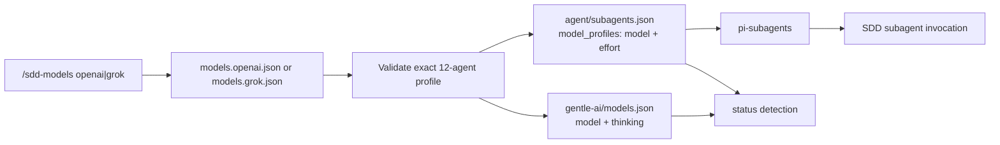

# Understand how model switching works

`/sdd-models` keeps a human-facing canonical profile and the `pi-subagents` runtime mapping aligned for exactly 12 SDD agents. It validates all required inputs before staging either output.

## Data flow

Paths are relative to `PI_HOME`, which defaults to `~/.pi`.

## Files read and written

| File | Read for status | Read for switch | Written for switch | Purpose |
|---|---:|---:|---:|---|
| `gentle-ai/models.openai.json` | Yes | Yes | No | Named OpenAI source profile. |
| `gentle-ai/models.grok.json` | Yes | Yes | No | Named Grok source profile. |
| `gentle-ai/models.json` | Yes | Yes | Yes | Active canonical mapping using `{ model, thinking }`. |
| `agent/subagents.json` | Yes | Yes | Yes | Live runtime mapping under `model_profiles` using `{ model, effort }`. |

When switching, unrelated keys in both active objects are retained. Only the 12 managed agent entries are replaced.

## Validation

Before status comparison or switching, each named profile must:

- be a JSON object;
- contain exactly the 12 managed SDD agent keys; and
- give every key string-valued `model` and `thinking` fields.

The active canonical file must provide valid managed `{ model, thinking }` entries. The runtime file must have an object-valued `model_profiles` property and valid managed `{ model, effort }` entries. Invalid or missing data prevents a switch before writes begin.

Both named profiles are loaded and validated even when selecting only one. This protects the command's known-profile contract as a whole.

## Atomic writes and rollback

A switch follows this sequence:

1. Read and retain the original text of both writable files.
2. Parse and validate current data.
3. Build new objects in memory, preserving unrelated keys.
4. Serialize both outputs with stable two-space JSON formatting and a trailing newline.
5. Create both temporary files in their destination directories with exclusive creation and mode `0600`.
6. Rename the canonical temporary file into place.
7. Rename the runtime temporary file into place.

A rename within the same filesystem/directory is atomic for each individual file. The pair is not one filesystem transaction, so the command tracks which replacements succeeded. If either replacement fails, it attempts to restore every already-replaced file through the same temporary-file-and-rename technique. Temporary files are discarded on a best-effort basis.

If rollback itself is incomplete, the error identifies the affected side. No success reload is attempted.

## Reload behavior

After both writes succeed, the extension calls Pi's reload API. Reload makes the updated runtime mapping available without requiring a full restart.

If reload fails, the write is **not** rolled back: the selected files remain installed. The UI asks the operator to run `/reload` manually or restart Pi. This distinction matters when diagnosing a reported reload error—the on-disk switch may still be complete.

## Active, custom, and unknown detection

Status compares all 12 managed entries in both active files with each known named profile:

- **`openai`**: canonical and runtime entries both match the OpenAI profile.
- **`grok`**: canonical and runtime entries both match the Grok profile.
- **`custom`**: all files validate, but the combined canonical/runtime mapping does not exactly match either known profile.
- **`unknown`**: reading, JSON parsing, or validation fails. The status output includes the error.

For each agent, `[misaligned]` appears when canonical `model`/`thinking` differs from runtime `model`/`effort`. A mapping can be `custom` without a drift marker when canonical and runtime agree with each other but differ from both named profiles.

## How `pi-subagents` consumes the mapping

The switch does not launch subagents itself. `pi-subagents-j0k3r` reads `agent/subagents.json` and uses `model_profiles[agent]` to select the runtime `model` and `effort` for a named subagent. The canonical `gentle-ai/models.json` file supports Gentle AI profile state and status comparison; the runtime consumer needs the translated `effort` field.

This package supplies mappings only. Gentle Pi provides the extension host and reload API, while `pi-subagents-j0k3r` provides subagent dispatch. Provider authentication and actual model availability remain external concerns.
