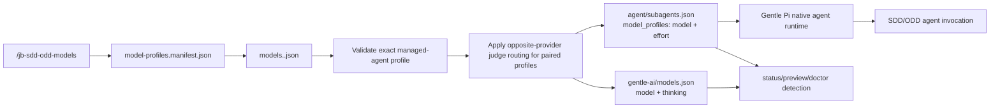

# Understand how model switching works

`/jb-sdd-odd-models` keeps a human-facing canonical profile and the Gentle Pi runtime mapping aligned for the managed SDD/ODD agents and any configured judge/reviewer agents. Profile names, managed agents, and opposite-provider judge routing are read from `gentle-ai/model-profiles.manifest.json`; named profile data lives in `gentle-ai/models.<profile>.json`.

## Data flow

Paths are relative to `PI_HOME`, which defaults to `~/.pi`. The extension also imports helper modules from `extensions/model-profiles/`, so installed packages must ship that directory next to `extensions/sdd-model-profiles.ts`.

## Commands

| Command | Writes files | Reloads Pi | Purpose |
|---|---:|---:|---|
| `/jb-sdd-odd-models` | No | No | Status plus usage. |
| `/jb-sdd-odd-models status` | No | No | Active-state and drift report. |
| `/jb-sdd-odd-models doctor` | No | No | Read-only diagnostics for files, local catalog evidence, auth status evidence, and transaction journals/locks. |
| `/jb-sdd-odd-models list` | No | No | Registered profiles from the manifest. |
| `/jb-sdd-odd-models preview <profile>` | No | No | Before → after canonical/runtime mapping for each managed agent. |
| `/jb-sdd-odd-models <profile>` | Yes, unless already aligned | Yes, only after writes | Activate a registered profile. |
| `/jb-sdd-odd-models undo` | Yes, if safe | Yes, after undo | Revert the last completed transaction when no intervening edits exist. |
| `/jb-sdd-odd-models recover` | Sometimes | Yes, after changed recovery | Finish, record, or clear an interrupted transaction from recorded safe states. |

A switch that is already semantically aligned leaves bytes and mtimes untouched and does not call reload, even if the files use different JSON formatting.

## Opposite-provider judges

The optional `oppositeProviderJudges` manifest block controls mixed judge routing. `enabled` defaults to `true`, but absent or empty `agents` preserves the previous uniform-profile behavior. The packaged manifest explicitly configures these judge/reviewer agents: `review-risk`, `review-resilience`, `review-readability`, `review-reliability`, `review-refuter`, `review-validator`, `jd-judge-a`, and `jd-judge-b`.

Version 1.1 packages GPT-5.6, GPT Astra, GPT Astra-only, and Grok low-cost/recommended/powerful profiles from `config/named-profiles.json`. The default installed profile is `openaigentle`; `openai` and `grok` remain compatibility aliases for `gpt-5.6-recommended` and `grok-recommended`.

Only paired profiles use opposite-provider judges. Selecting a paired GPT-family lane writes normal SDD/ODD agents from that profile and judge/reviewer agents from the matching Grok lane. Selecting a paired Grok lane writes normal agents from Grok and judges from the matching GPT-5.6 lane. Unpaired profiles, including `openaigentle`, retain their own judge mappings.

## Managed effort mapping

The runtime mapping uses `model_profiles[agent] = { model, effort }`. The canonical profile uses `{ model, thinking }`; switching copies `thinking` to runtime `effort`.

Profiles accept any nonempty, already-trimmed effort string, including `max` and model-specific values. Values are preserved verbatim: the package does not trim, lowercase, whitelist, or downgrade them. The original `openaigentle` archive mapping remains `openai-codex/gpt-6-luna` with `thinking: max` and runtime `effort: max`.

Profile acceptance is separate from capability diagnostics. `doctor` uses the installed Pi registry:

- the model must be found through `ctx.modelRegistry.find(provider, modelId)` and have `reasoning: true`;
- `thinkingLevelMap[level] === null` means unsupported;
- existing baseline diagnostics for `low`, `medium`, and `high` remain compatible on reasoning models unless explicitly disabled;
- all other levels, including `xhigh`, `max`, and model-specific values, require an own `thinkingLevelMap[level]` entry that is neither null nor undefined; and
- when the registry is unavailable, catalog, auth, and effort checks are skipped rather than assumed successful.

These are local capability checks, not provider requests or execution guarantees. A successful profile switch preserves the requested effort even if `doctor` warns about it; the installed runtime or provider may still reject unsupported levels.

## Files read and written

| File | Read for status/list/preview/doctor | Read for switch/undo/recover | Written for switch/undo/recover | Purpose |
|---|---:|---:|---:|---|
| `gentle-ai/model-profiles.manifest.json` | Yes | Yes | No | Profile registry, managed agent groups, and default profile. |
| `gentle-ai/models.<profile>.json` | Yes | Yes | No | Named source profiles. |
| `gentle-ai/models.json` | Yes | Yes | Yes | Active canonical mapping using `{ model, thinking }`. |
| `agent/subagents.json` | Yes | Yes | Yes | Live runtime mapping under `model_profiles` using `{ model, effort }`. |
| `gentle-ai/.model-profiles-transactions/*` | Doctor/recover/undo inspect | Yes | Yes | Lock, active journal, and history for safe two-file transactions. |

When switching, unrelated top-level keys and unrelated `model_profiles` entries are retained. Only managed agent entries are replaced or added.

## Validation and repair boundary

Before status comparison or switching, each registered named profile must:

- be a JSON object;
- contain exactly the manifest's active managed SDD/ODD keys plus configured judge/reviewer keys; and
- give every key a `model` in `provider/model` form and a nonempty, already-trimmed `thinking` string.

The active runtime file must have an object-valued `model_profiles` property. Existing managed entries in the active canonical/runtime files are validated before a switch. Missing managed entries from older installs, such as newly added `sdd-research`, are repairable during a switch and are added from the selected profile. Malformed existing entries are not repaired silently; the switch stops before writing.

Unrelated runtime mappings are intentionally preserved and reported by `doctor`; they are not false errors.

## Durability and recovery limits

Profile mutation uses a journaled two-file transaction:

1. Create an exclusive lock in `gentle-ai/.model-profiles-transactions/lock.json`.
2. Read and hash both target files.
3. Write an active journal containing before/after content and hashes.
4. Replace `gentle-ai/models.json` through a same-directory temporary file and rename.
5. Replace `agent/subagents.json` the same way.
6. Move the completed record into transaction history and remove the active journal.
7. Release the lock.

Exact durability claim: each individual target file replacement uses a durable temp-file write, file sync, rename, and best-effort directory sync. The pair is not filesystem-atomic: a crash can leave one file replaced and the other still old. Recovery uses the active journal to finish or roll back only when current bytes match recorded `before` or `after` hashes.

Safety limits:

- A noncooperating writer that edits either target outside this transaction can create unknown bytes; recovery refuses to overwrite unknown content.
- A stale lock from a dead process can be replaced only by `recover`; `doctor` reports it and does not reclaim it.
- A live lock refuses switch/undo/recover.
- Malformed active or history journals are explicit diagnostics. `doctor` does not clear them, and recovery refuses unsafe state.
- Undo is guarded: it only runs when both files still match the last committed transaction output.

## Reload behavior

After a successful switch, undo, or changed recovery, the extension calls Pi's reload API exactly once and treats a successful reload as terminal for the handler.

If reload fails, the write is not rolled back: the selected files remain installed. The UI asks the operator to run `/reload` manually or restart Pi.

## Active, custom, and unknown detection

Status and doctor compare all managed entries in both active files with each registered named profile:

- **registered profile name**: canonical and runtime entries both match that profile. When multiple aliases match the same bytes, the manifest order prefers the named default over legacy aliases.
- **`custom`**: all files validate, but the combined canonical/runtime mapping does not exactly match a registered profile.
- **`unknown`**: reading, JSON parsing, validation, or required managed-entry inspection fails.

For each agent, `[misaligned]` appears in status when canonical `model`/`thinking` differs from runtime `model`/`effort`. A mapping can be `custom` without a drift marker when canonical and runtime agree with each other but differ from every named profile.

## Runtime boundary

The switch does not launch agents itself. It supplies mappings for Gentle Pi's native agent runtime through `agent/subagents.json`. Provider authentication, project overrides, local catalog contents, and actual provider execution remain outside this package.
